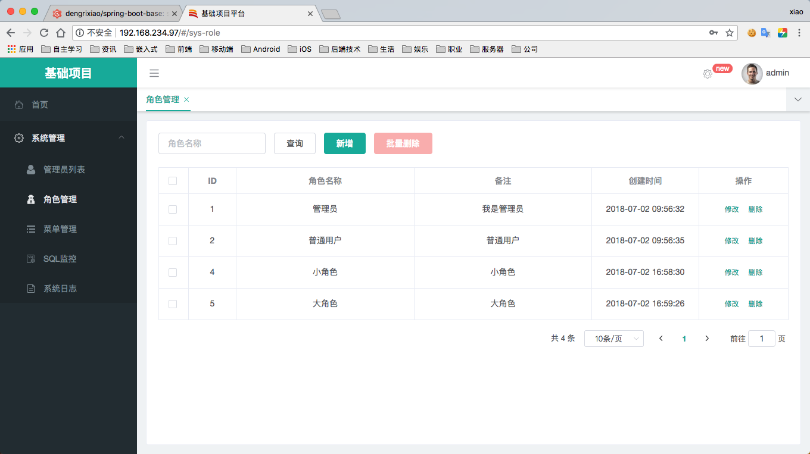
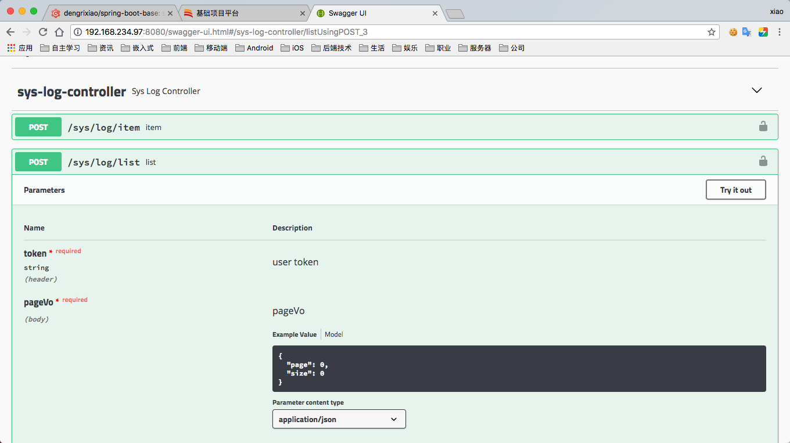
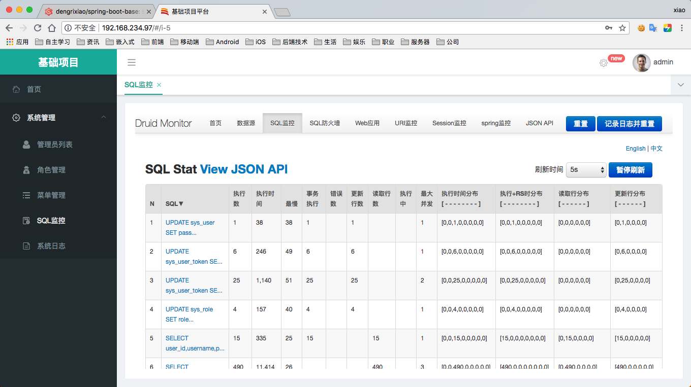

# spring-boot-base-vue

- spring-boot-base-vue基于vue、element-ui构建开发，实现spring-boot-base后台管理前端功能，提供一套更优的前端解决方案
- 前后端分离，通过token进行数据交互，可独立部署


# 说明文档

## 项目结构

```
spring-boot-base-vue

├─build     工程配置
├─config    项目配置
├─dist      静态生成文件
├─src       项目源文件
│  ├─assets             静态资源
│  ├─components         组件
│  ├─element-ui         element-ui
│  ├─element-ui-theme   element-ui主题
│  ├─icons              图标
│  ├─mock               mock模拟数据
│  ├─router             路由
│  ├─store              状态存储
│  ├─utils              工具类
│  └─views              界面
├─static    静态资源
├─test      测试
│ 
├─package.json 项目配置依赖
│  

```

## 演示环境

### 1.前端界面

https://xxx.com/



### 2.后台接口

https://xxx.com/swagger-ui.html



### 3.sql监控

https://xxx.com/druid/sql.html




# 更新日志

## 04-12 

1. 更新 README.md
